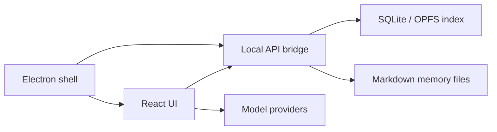

# Vortex

Vortex is a local-first agent workspace for long-running AI work: multi-agent chat, persistent memory, local RAG, workflow automation, and a macOS desktop shell.

The core design principle is simple: user-editable Markdown and project-local configuration stay as the source of truth, while SQLite and runtime services act as rebuildable indexes, caches, and local bridges.

## Highlights

- Multi-session agent workspace with branchable conversations and per-topic runtime settings.
- Local-first memory under `memory/agents/<agent-slug>/`, including daily notes, corrections, reflections, and agent-private skills.
- SQLite-backed knowledge retrieval with document quality scoring, evidence feedback, rerank weights, and local search preferences.
- LangGraph-oriented agent runtime with streaming output, tool calls, Responses API support, and model/provider compatibility controls.
- Workflow task graph support for planner, dispatcher, worker, reviewer, retries, background execution, and review rollups.
- Settings workspace inspired by modern desktop AI tools: full-screen settings, compact rows, light/dark themes, accent colors, and macOS-only glass styling.
- Electron desktop shell with a bundled local API bridge, native dialogs, tray integration, notifications, global shortcuts, and packaged workspace bootstrapping.

## Status

Vortex is usable as a local development app and unsigned macOS desktop build. It is not production-distribution ready yet.

Before public release, review:

- macOS signing and notarization.
- GitHub release packaging beyond the current `.app` directory target.
- Safe defaults in `config.example.json`.
- Private local state in `.gitignore`.
- Any project-specific memory files before publishing.

## Tech Stack

- React 19, TypeScript, Vite, Tailwind CSS 4
- Electron 41 and electron-builder
- Express local API bridge
- SQLite WASM / OPFS for local indexing
- LangChain / LangGraph model runtime pieces
- Motion for UI transitions

## Quick Start

```bash
npm install
npm run dev
```

Default local services:

- Web UI: `http://127.0.0.1:3000`
- Local API server: `http://127.0.0.1:3850`

Run only the web UI:

```bash
npm run dev:web
```

Run only the local API server:

```bash
npm run api-server
```

## Desktop App

Preview the Electron app from source:

```bash
npm run desktop:preview
```

Build an unsigned macOS app:

```bash
npm run desktop:build
```

Current output:

```text
release/mac-arm64/Vortex.app
```

Notes:

- The packaged app starts the local host bridge automatically.
- Packaged workspace data defaults to the app support workspace resolved by the Electron runtime.
- The current macOS build is unsigned and not notarized. Gatekeeper behavior may vary outside local development machines.

## Configuration

Private local config lives in:

```text
config.json
```

The committed template is:

```text
config.example.json
```

Useful environment variables:

- `VORTEX_API_PORT`: local API server port.
- `VORTEX_PROJECT_ROOT`: project root used by the API server.
- `VORTEX_API_TOKEN`: optional bearer token for local API requests.
- `VORTEX_ELECTRON_MANAGE_HOST=false`: let Electron reuse an external API server during development.

## Memory Layout

```text
memory/
└── agents/
    └── <agent-slug>/
        ├── MEMORY.md
        ├── corrections.md
        ├── reflections.md
        ├── daily/
        │   ├── YYYY-MM-DD.md
        │   ├── YYYY-MM-DD.warm.md
        │   └── YYYY-MM-DD.cold.md
        └── skills/
            └── <skill-name>/SKILL.md
```

These files are intentionally local/private by default.

## Architecture



## Scripts

```bash
npm run dev              # web UI + local API server
npm run dev:web          # Vite only
npm run api-server       # local API server only
npm run lint             # TypeScript check
npm run build            # web build
npm run build:host       # host bridge bundle
npm run desktop:preview  # Electron preview
npm run desktop:build    # unsigned macOS .app
npm run hooks:install    # install Vortex git hooks
```

## Repository Notes

- `src/` contains the React application.
- `electron/` contains the desktop shell and native bridge handlers.
- `server/` contains the local API server.
- `dist-host/` is generated by `npm run build:host`.
- `release/` is generated by electron-builder.

## License

No license file is currently included. Add one before publishing or distributing the project publicly.
