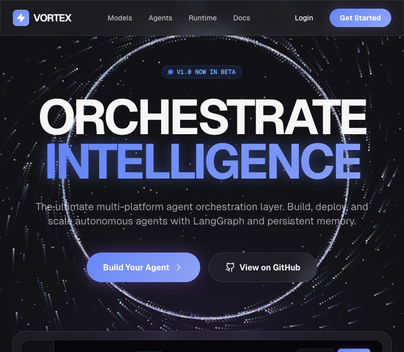
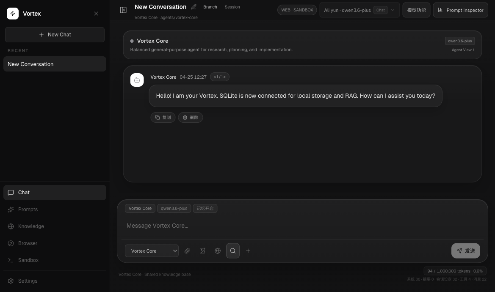
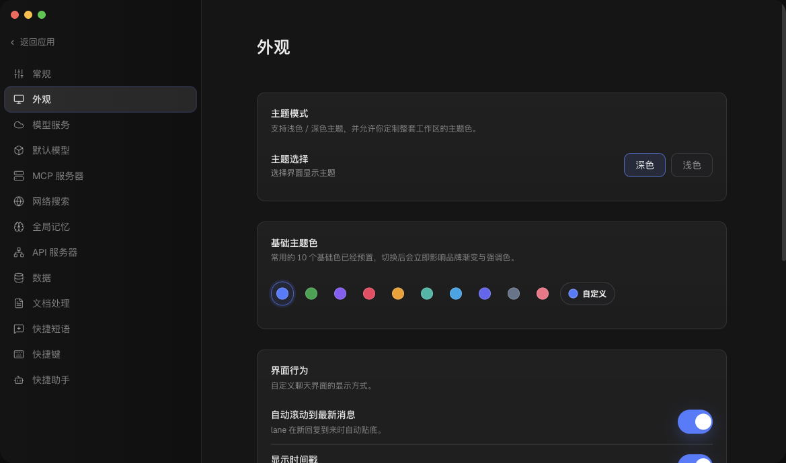
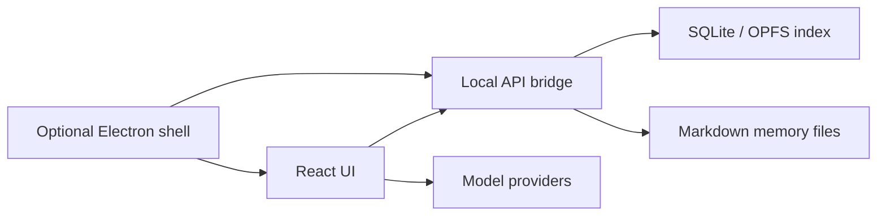

<p align="center">
  
</p>

<h1 align="center">Vortex AI</h1>

<p align="center">
  A local-first agent workspace for multi-agent chat, persistent memory, local RAG, workflow automation, and optional desktop builds.
</p>

<p align="center">
  
  
  
  
</p>

## What It Is

Vortex AI is a web-first, local-first AI workspace. It keeps the user-owned parts of the system in project-local files and rebuildable local indexes:

- Markdown memory is the source of truth.
- SQLite / OPFS is the rebuildable local retrieval layer.
- The local API bridge powers desktop features without making the web UI depend on a packaged app.
- Electron is optional: you can run Vortex as a local web app, or build a macOS app when you want a desktop shell.

## Visual Tour

<table>
  <tr>
    <td width="50%">
      
    </td>
    <td width="50%">
      
    </td>
  </tr>
  <tr>
    <td><strong>Agent workspace</strong><br />Threaded sessions, model controls, tools, memory status, and a compact command composer.</td>
    <td><strong>Desktop-style settings</strong><br />Full-screen settings, compact rows, theme presets, light/dark support, and macOS-only glass styling.</td>
  </tr>
</table>

## Core Capabilities

| Area | What Vortex Provides |
| --- | --- |
| Agent workspace | Multi-session chat, branchable topics, per-topic runtime settings, model controls, tool visibility, and streaming output. |
| Local memory | File-backed agent memory under `memory/agents/<agent-slug>/`, with daily notes, corrections, reflections, and agent-private skills. |
| Retrieval | SQLite-backed local RAG with evidence feedback, rerank weights, document quality scoring, and provider-aware search settings. |
| Workflows | Planner, dispatcher, worker, reviewer structure with retries, background execution, handoff, and review rollups. |
| Runtime | LangGraph-oriented runtime pieces, OpenAI-compatible providers, Responses API support, and local API diagnostics. |
| Desktop | Optional Electron shell with native dialogs, tray, notifications, global shortcuts, and a bundled local host bridge. |

## Local Development

```bash
npm install
npm run dev
```

Default local services:

```text
Web UI:           http://127.0.0.1:3000
Local API bridge: http://127.0.0.1:3850
```

Run only the web UI:

```bash
npm run dev:web
```

Run only the local API bridge:

```bash
npm run api-server
```

## Build

Build the web app:

```bash
npm run build
```

Type-check the project:

```bash
npm run lint
```

Build the host bridge bundle:

```bash
npm run build:host
```

## Optional Desktop App

Preview the Electron app from source:

```bash
npm run desktop:preview
```

Build an unsigned macOS app:

```bash
npm run desktop:build
```

Current output:

```text
release/mac-arm64/Vortex.app
```

The current desktop build is unsigned and not notarized. It is intended for local development and internal testing, not public macOS distribution.

## Configuration

Private local config lives in:

```text
config.json
```

The committed starter template is:

```text
config.example.json
```

Useful environment variables:

| Variable | Purpose |
| --- | --- |
| `VORTEX_API_PORT` | Local API bridge port. |
| `VORTEX_PROJECT_ROOT` | Project root used by the API bridge. |
| `VORTEX_API_TOKEN` | Optional bearer token for local API requests. |
| `VORTEX_ELECTRON_MANAGE_HOST=false` | Let Electron reuse an external API bridge during development. |

## Memory Layout

```text
memory/
└── agents/
    └── <agent-slug>/
        ├── MEMORY.md
        ├── corrections.md
        ├── reflections.md
        ├── daily/
        │   ├── YYYY-MM-DD.md
        │   ├── YYYY-MM-DD.warm.md
        │   └── YYYY-MM-DD.cold.md
        └── skills/
            └── <skill-name>/SKILL.md
```

These files are intentionally local/private by default and are excluded from the repository.

## Architecture



## Scripts

```bash
npm run dev              # web UI + local API bridge
npm run dev:web          # Vite only
npm run api-server       # local API bridge only
npm run lint             # TypeScript check
npm run build            # web build
npm run build:host       # host bridge bundle
npm run desktop:preview  # Electron preview
npm run desktop:build    # unsigned macOS .app
npm run hooks:install    # install Vortex git hooks
```

## Repository Notes

- `src/` contains the React application.
- `electron/` contains the optional desktop shell and native bridge handlers.
- `server/` contains the local API bridge.
- `docs/assets/` contains README screenshots.
- `dist/`, `dist-host/`, and `release/` are generated outputs and are not committed.

## License

No license file is currently included. Add one before publishing or distributing the project publicly.
